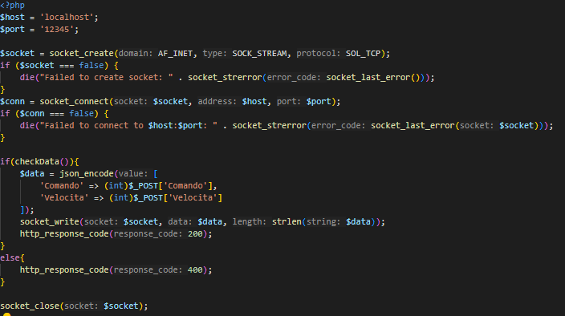

# Progetto Robot

## Spiegazione

### Idea principale

L'idea principale del progetto è dare possibilità al robot di essere controllato da una applicazione web per simulare un controllo da remoto, dalla applicazione web si possono visualizzare i valori dei sensori del robot e i tasti per il movimento.  

Insieme all'idea precedente, si è ipotizzato se sia possibile una pseudo programmazione in Python del robot, dato che l'interprete di Python è in C e al robot basta ricevere i comandi, questo dovrebbe essere possibile.

### Pianificazione

#### Parte Applicazione

Per rendere possibile la comunicazione tra il robot e l'applicazione web servirebbe un modulo wifi, ma visto che c'è solo il modulo Bluetooth installato questo non è possibile farlo direttamente.  
Quindi per aggirare il problema ho pensato di fare un servizio "Bridge" in python che prende i dati dal canale seriale virtuale(Bluetooth) e con essi fa una richiesta(POST) al Server Web che li salva e visualizza(Serial → Bridge → Server) e vice versa(Server → Bridge → Serial).  
Questo servizio farà appunto da "ponte" per ovviare al problema del modulo wifi.

#### Parte Server Web

L'applicazione Web è "divisa" in 2 sezioni principali, la parte di controllo del robot, dove è possibile impostare la velocità e tramite relativi pulsanti fare certi muovimenti, e la parte di visualizzazione dei dati dei sensori del robot.  
Ci sarà uno script in js che si occupa di aggiornare i dati visualizzati ogni tot e rendere funzionanti i pulsanti facendo delle fetch per inviare i dati al server.  
Il server successivamente aprirà un socket, in modo da comunicare con il servizio di Bridge, e invierà i dati ad esso(Server → Bridge → Serial).

### Funzionamento

#### Bridge

Il servizio in Python, una volta richiesta input la porta con cui ci si vuole interfacciare, si divide in 2 thread:

1. Listening Serial: continua ad essere in ascolto della porta seriale(robot) in attesa di un pacchetto dati(10byte).  
 una volta ricevuto "spacchetta" il pacchetto ricavandone i dati dei sensori per poi successivamente inviarli tramite POST al Server Web.

2. Listening Socket: continua ad essere in ascolto del Server Socket che viene creato con il Server Web, in attesa che un client(Client Socket) si connette ed invii i dati.  
Una volta ricevuti li "impacchetta" e li invia alla seriale(robot).  

In entrambi i casi i pacchetti per lo scambio dei dati con la seriale hanno la seguente struttura:

```py
Robot → Bridge
#[START_BYTE(1), HEADER_FOLLOW_LINE(1), DATA_FOLLOWLINE(1), HEADER_ULTRASONIC(1), DATA_ULTRASONIC(4), CHECKSUM(1), END_BYTE(1)]  
Data ultrasonic è di tipo float per quello usa 4 byte

Bridge → Robot
#[START_BYTE(1), HEADER_COMANDO(1), DATA_COMANDO(1), HEADER_VELOCITA(1), DATA_VELOCITA(1), CHECKSUM(1), END_BYTE(1)]

START_BYTE = b'\xaa'
HEADER_FOLLOW_LINE = b'\x01'
HEADER_ULTRASONIC = b'\x02'
HEADER_COMANDO = b'\x03'
HEADER_VELOCITA = b'\x04'
END_BYTE = b'\xff'
```

Entrambi i pacchetti hanno un byte di inizio e di fine per segnare l'inzio e la fine del pacchetto, degli header per identificare il tipo di dato, e infine il checksum per l'integrità dei dati.

#### Server Web

Il server riceve i dati e li salva su un json, in modo che i client che si connettono al server possono ricavare i dati dal json e visualizzari.


Dal lato client lo script js ad intervallo continuo effettua delle richieste (fetch) a `leggi.php` che restituisce un json contenente i dati dei sensori. Lo script aggiunge anche una funzione a tutti i pulsanti: nel momento in cui si preme il pulsante, verrà inviata una fetch a `invia.php` contenente il valore del pulsante e la velocità selezionata invece quando si rilascia il pulsante, viene inviata un'altra fetch con entrambi i valori a 0 (servirà a bloccare il robot).

Dal lato server, una volta che invia.php riceve la richesta con i dati, questo avvia una connessione tramite socket con il servizio di Brige che a sua volta trasmetterà i dati al robot per controllaro.



#### Robot

Il robot deve essere programmato in modo che invii i dati dei suoi sensori al bridge e che risponda ai comandi ricevuti. Per fare ciò si fa uso della `Serial3` (da [schematica](https://support.makeblock.com/hc/article_attachments/13680199889175), il bluetooth). Prima invia i dati dei sensori, impacchettandoli, alla seriale. Poi se sulla seriale ci sono in attesa 7 byte (dimensione pacchetto di controllo), il robot li legge, controlla l'integrità dei dati ed infine esegue il comando ricevuto.  
Per rendere possibile questo tipo di operazioni tramite mBlock ho usato un estensione che ti permette di aggiungere parti di codice(c++) sempre tramite i blocchi.


#### Programmazione robot in Python

Usando la stessa logica del Bridge, e del robot che è stato programmato apposta per ricevere ed inviare dati, si può programmare quest'ultimo in Python. Per prova è stato riscritto il programma del sumo robot in Python.


### Emulazione

Non avendo a disposizione il robot 24/7, per verificare il funzionamento di tutto si è fatto utilizzo di:

1. com0com, per emulare il canale bluetooth.
2. Un applicazione in cpp sviluppata apposta per emulare il robot e quindi leggere i comandi ricevuti ed inviare dati(randomici).

Ci sono 2 applicazioni di emulazione, una che riceve i comandi e li visualizza, e l'altra che oltre a fare ciò invia i dati fasulli dei sensori per vedere il funzionamento.

  
A sinistra il processo in Python e a destra l'emulatore.

## Utilizzo

### Requisiti

- [Python 3.x](https://www.python.org/) → servizio bridge.
- Librerie Python:

    ```bash
    pip install pyserial requests
    ```

- [XAMPP](https://www.apachefriends.org/it/index.html) → server PHP locale.
- [mBlock](https://mblock.cc/) → programmazione robot

### Installazione porte seriali virtuali e monitor seriale (Test Only)

Se non si dispone del robot ma comunque si vuole provare il programma.

#### Installazione com0com

- Apri la cartella `/emulatore/` ed esegui il setup di `com0com`.
- Segui i passaggi per l'installazione.
- Quando richiede quali componenti si vogliono installare deseleziona gli ultimi 2.

      

- Una volta terminata l'installazione chiudere il setup senza avviare l'app.

#### Installazione drivers

- Apri la cartella `/emulatore/drivers/` ed esegui `setupc` come amministratore.
- Nel terminale che si è aperto eseguire il seguente comando.

    ```bash
    install - -
    ```

#### Configurazione porte seriali

- Avviare l'app installata in precedenza.

    

- Seleziona `Virtual Port Pair 0`.
- Fare doppio click sul nome delle porte e rinominarle (usa la prima coppia di porte disponibile).
  - CNCA0 → COM4
  - CNCA0 → COM5

  

- Una volta rinominate cliccare su applica.

#### Verica porte virtuali

Per verificare se tutto è stato eseguito correttamente seguire i seguenti passaggi

- Digita `Gestione Dispositivi` nella barra di ricerca e apri il programma, poi seleziona `com0com - serial port emulators`.
- Verifica che siano presenti 3 dispositivi, uno è il bus e i restanti sono le porte.

      
Si dovrebbe visualizzare una situazione simile all'immagine soprastante.

### Configurazione XAMPP

1. Prendere i file contenuti in `/web application/` ed inserirli all'interno di una cartella in htdocs di XAMPP.
2. Aprire XAMPP, premere su `Config` di Apache → `PHP(php.ini)` (percorso file: `C:\xampp\php\php.ini`).
3. Cercare `;extension=sockets` e togliere il `;` per abilitare i sockets per php.

### Scaricare Estensioni su mBlock

1. Sul programma mBlock premere sul pulsante `Estensioni`  
    
2. Seleziona e scarica  `AdvancedArduinoCode` e `Switch Case`

    

### Utilizzo applicazione web

Per utilizzare l'applicazione web effettuare i seguenti passaggi in ordine:

1. Aprire `SerialBridge.py` e modificare la costante PHP_SERVER_URL in modo da raggiungere sempre il file `ricezione.php`.

    ```py
    PHP_SERVER_URL = 'http://localhost/{cartella_htdocs}/ricezione.php'
    ```

2. Avviare `SerialBridge.py` e selezionare la porta COM che corrisponde al bluetooth del robot e il baudrate (default 9600).
3. Avviare il server Apache da XAMPP.
4. Seguire i passaggi se si dispone o non del robot.

    - Se si dispone del robot, caricare `Progetto Robot.mblock` nel robot e accenderlo.
    - Se non si dispone del robot, avviare `Recieve.exe` o `RecieveDataSend.exe`(simula i sensori) e selezionare la porta COM emulata precedentemente.

5. Aprire dal browser la pagina web.
6. Usa i pulsanti per controllare il robot.

    

### Utilizzo per programmazione in Python

Se si vuole programmare in Python il robot si può fare riferimento al file `SumoRobot.py`.  
Come si può vedere, nel file c'è sempre la sezione per la communicazione seriale tra il programma e il robot(da non toccare), la sezione che ci interessa è dentro il metodo programma.  
Come procedere:  

- Copiare il file `SumoRobot.py` e cancellare i metodi zona_bianca e spingi_ostacolo, e anche il cliclo while True sotto l'input nel metodo programma.

- Adesso all'interno del metodo programma, sempre sotto l'input, e possibile programmare il robot, esiste già una funzione chiamata move(comando, velocita), che si occupa di far fare i muovimenti base al robot.  

    

Per utilizzarlo e vederne il funzionamento:

1. Seguire i passaggi se si dispone o non del robot.
    - Se si dispone del robot, caricare `Progetto Robot.mblock` nel robot e accenderlo.
    - Se non si dispone del robot, avviare `Recieve.exe` o `RecieveDataSend.exe`(simula i sensori) e selezionare la porta COM emulata precedentemente.
2. Avviare il processo in Python, che richiede la porta COM e il baudrate(default 9600), il processo poi rimarrà in attesa di input per avviare il programma.
3. Premere un qualsiasi tasto per avviare il programma e vedere il funzionamento(se con gli emulatori non funziona, avviare prima il processo in python, poi l'emulatore, e infine premere un tasto per avviare il programma).

## Considerazioni 16/04/2025

In laboratorio, avendo il robot a disposizione, siamo riusciti a testare il programma. C'è stato un problema con il collegamento bluetooth, forse perché il modulo è limitato solo alle app di makeblock o qualcosa del genere, ma comunque usando il cavo si è riuscito ad aggirare il problema, sul programma `Progetto Robot.mblock` ho cambiato la serial da `Serial3(bluetooth)` a `Serial(Usb)` e il robot ha funzionato come previsto. Prima abbiamo provato a comandare il robot dal servizio web ed infine abbiamo provato anche il programma in python per mantenere il robot all'interno di un'area delimitata da bordi neri, ed entrambi hanno funzionato come previsto.  
Quindi infine l'unico problema sarebbe trovare un modo per sistemare il collegamento bluetooth, che una volta risolto si potrà programmare il robot in python senza cavo e senza il bisogno di ricaricare il programma sul robot.

  

Ho sottolineato in rosso le modifiche apportate per cambiare la serial da Serial3 a Serial

## Autori

- **Giona Dal Pont**, parte software (Bridge, robot/emulatore)
- **Michael Spinellino**, parte server (Front-end e Back-end)  
